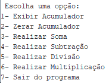

# Calculadora com Acumulador

Essa aplicação funciona como uma calculadora, na qual as operações são cumulativas e o resultado é armazenado no acumulador. Ao ser executado o programa, o menu de opções é exibido:

Após cada opção selecionada o menu é exibido novamente, até que o usuário seleciona a opção '7- Sair do programa'. Ao selecionar a opção '1' é possível visualizar o resultado dos cálculos realizados, já a opção '2' zera o acumulador e permite iniciar os cálculos novamente.

A seguir, é possível visualizar o código da aplicação e fazer download do arquivo em formato compatível com o software Mars:
* [Calculadora](./calculadora.asm)
