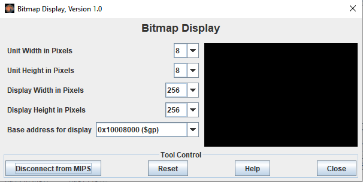
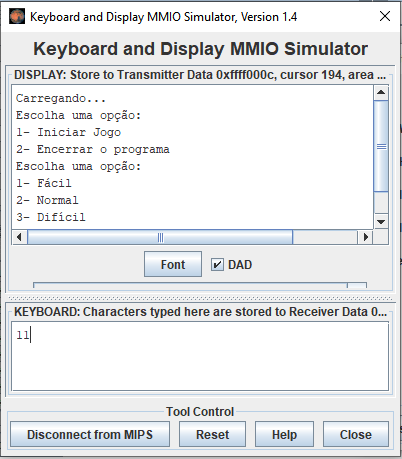

# Jogo Genius

Genius é um jogo de memorização, popular da década de 1980. O modo de jogo que será reproduzido, consiste em memorizar a sequência em que os botões se acendem e reproduzi-la em seguida. 

Utilizando linguagem assembly MIPS e o software Mars foi desenvolvida uma aplicação para reproduzir esse jogo:

* [Jogo Genius em Assembly](./Projeto.asm)

A seguir será demostrado como joga-lo:

* Inicialmente é necessário fazer o download do software [Mars](https://courses.missouristate.edu/KenVollmar/MARS/)
* Em seguida abrir o arquivo [Jogo Genius em Assembly](./Projeto.asm) no Mars
* Compilar o código utilizando o ícone 
* Na opção 'Tools' abrir e conectar o 'Keyboard and Display MMIO Simulator'.
* Também na opção 'Tools' abrir o 'Bitmap Display' conecta-lo e configura-lo conforme a imagem abaixo:
 
* O jogo está pronto para ser iniciado, basta executa-lo clicando no ícone 
* As informações e opções do jogo irão aparecer na parte superior do 'Keyboard and Display MMIO Simulator' e você irá digitar a opção que deseja digitando na parte inferior, por exemplo:

* No 'Bitmap Display' você verá os botões da seguinte forma:

* Para reproduzir a sequência em que as cores acenderam, serão utilizadas as teclas I para cor verde, O para amarelo, K para vermelho e L para azul. Todas as teclas em letra maiúscula, outras teclas serão consideradas erradas. Vale lembrar que não é necessário clicar a tecla 'enter' após a opção desejada.
* Prontinho! Agora só se divertir e exercitar sua memória com o Genius!

